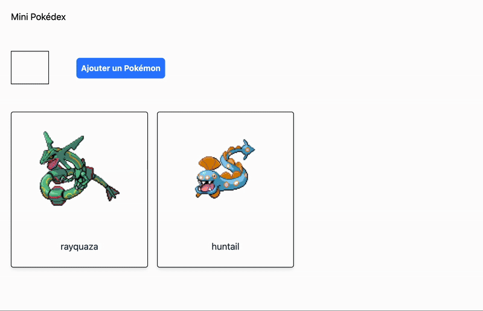

# Start dev

```bash
  npm install
  npm run dev
```

## TODO:

- Create a minimalist Pokedex.

- Use fetchRandomPokemon or fetchSpecificPokemon to get Pokémon data. 

- Rules:

- Display two random Pokémon on page load.

- Add a from with :
  - a button and input (number between 1 - 898); 
  - when our submit form (onSubmit) add a new Pokémon to the list.

Minimalist Pokedex

