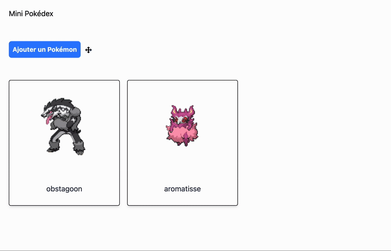

# Start dev

```bash
  npm install
  npm run dev
```

## TODO:

- Create a minimalist Pokedex.

- Use fetchRandomPokemon to get Pokémon data.

- Rules:

- Display two random Pokémon on page load.

- Add a button; on click, add a new Pokémon to the list.

Minimalist Pokedex

