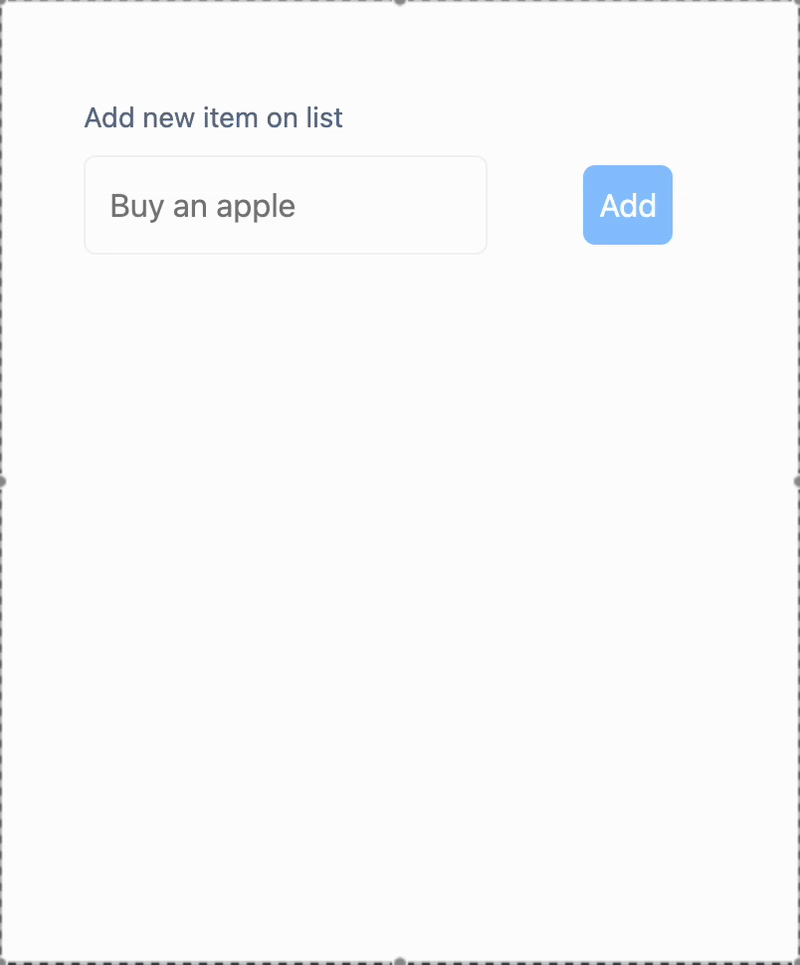

# Start dev

```bash
  npm install
  npm run dev
```

## TODO:

- Create a minimalist Todo List
- Add an input with an onChange event to update a state (value)
- Add a button with an onClick event:
- When clicked, add the current value state to another state (todoItems)
- Create a component named TodoItem, which returns an <li> and receives content as a prop
- Map your todoItems state to a list of TodoItem components

